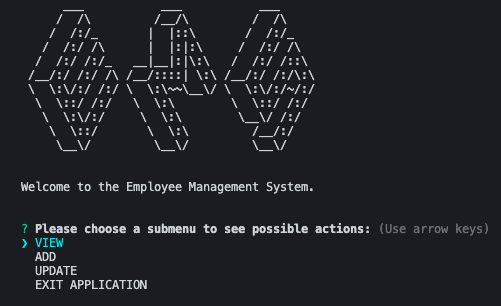
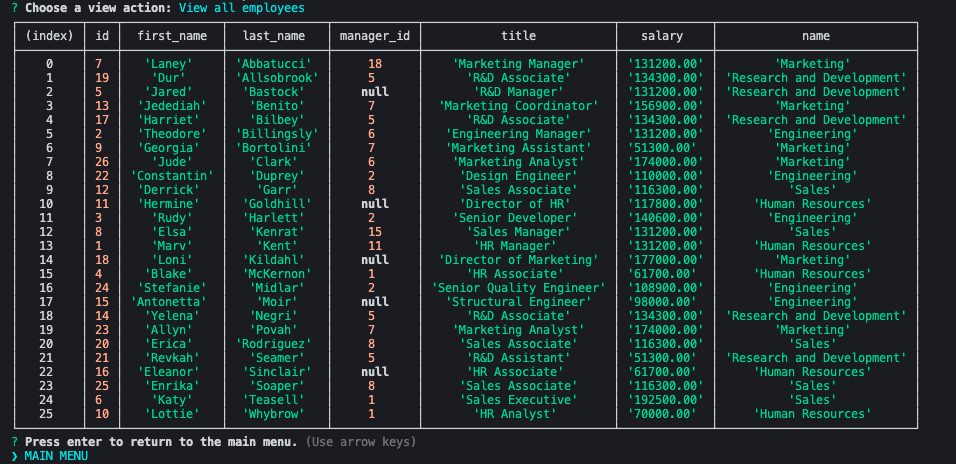
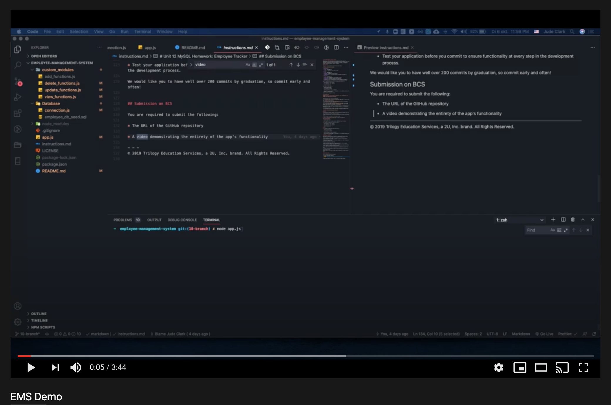

# Employee Management System

## Description

This CLI app is used to interface with a database of employee data. This repo contains a schema/seeds with mock data.

### Welcome Screen

### Viewing a table of data

---

## Installation

You must have node.js, MySQL, and MySQL Workbench installed to use this app.

1. Clone the repository.
2. Run "npm install" to download the necessary packages.
3. Run "node app.js" to start the application.

---

## Usage

Once you launch the application, you should find the user flow very self-explanatory.
Feel free to watch this demo video:

---

## License

